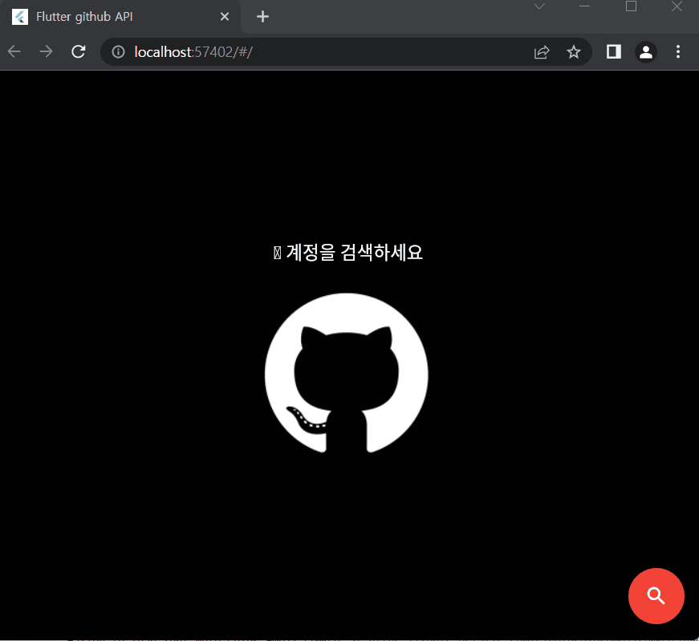
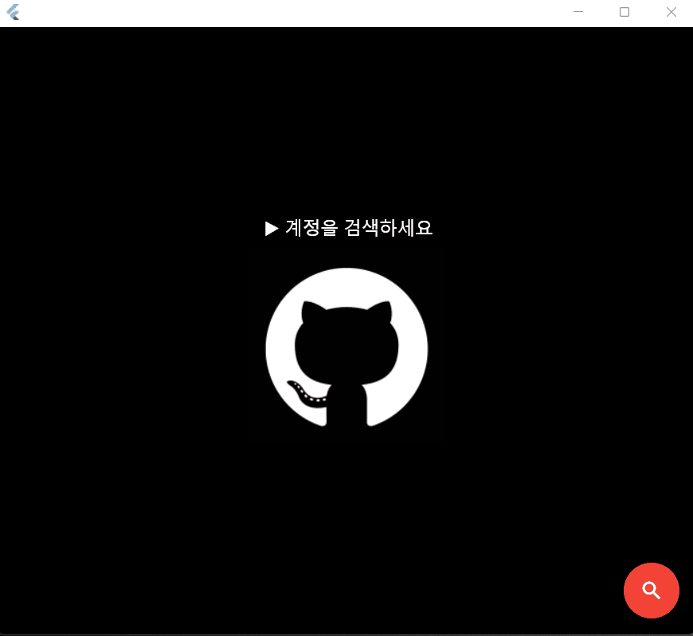
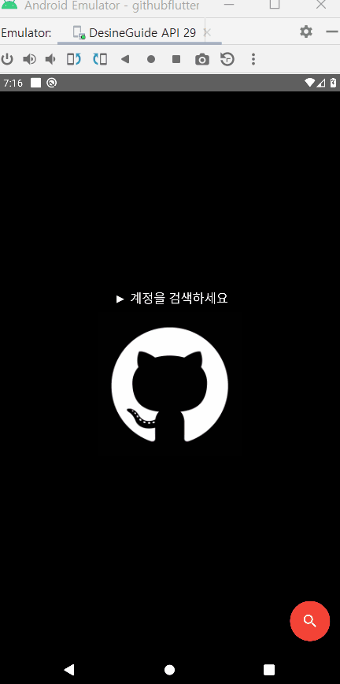

# githubflutter
> flutter로 만들어보는 github api 예제

1. 통신은 dio와 retrofit 사용
2. 사용시 다음과 같은 방법으로 코드를 생성해야 함

~~~
// @RestApi(baseUrl: "")가 정의된 파일에서 시작.... <= 레트로핏 Interface 정의파일 (예제에서는 RestClient.dart)
// 0. 같은 파일에 데이터정의
// 1. fromJson. toJson 함수를 정의하되 생성될 함수명을 _$로 대입(에러발생무시)
// 2. flutter pub run build_runner build
// 3. data 정의부분만 파일로 분리
// 4. g.dart 파일에서 fromJson, toJson만 잘라내서 Data정의된 파일에 붙이기
~~~

3. github api에 사용된 예제는 인증키가 없으므로 서버에서 종종 에러를 발생할 것임.

4. web 빌드화면

5. desktop 빌드화면

6. Android 빌드화면

